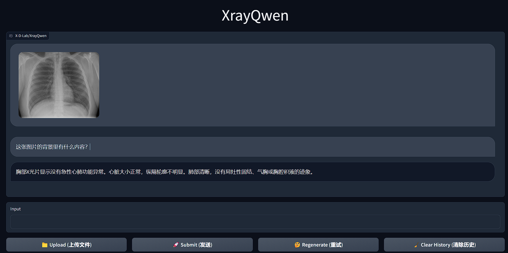

<h1 align="center">XrayQwen</h1>
<p align="center">
<a href="https://github.com/X-D-Lab/XrayQwen"></a>
<a href="https://huggingface.co/X-D-Lab"></a>
<a href="https://modelscope.cn/organization/X-D-Lab"></a>
</p> 
<!-- 
<div align="center">

[](https://github.com/X-D-Lab/XrayQwen/blob/main/LICENSE)
[](https://github.com/X-D-Lab/XrayQwen/stargazers)
[](https://github.com/X-D-Lab/XrayQwen/fork)
[](https://github.com/X-D-Lab/XrayQwen/graphs/contributors)  
</div> -->

## 📕 项目介绍

我们在[文心一言](https://yiyan.baidu.com/)的帮助下从[MIMIC-CXR](https://physionet.org/content/mimic-cxr-jpg/2.0.0/)和[OpenI](https://openi.nlm.nih.gov/faq#collection)两个两个数据集的自由文本放射学报告中生成中文版X射线报告配对数据用于本项目的训练数据, 并经过人工清洗和筛选. 

我们利用上述数据在强大的基座模型[Qwen-VL](https://github.com/QwenLM/Qwen-VL)上进行微调, 得到XrayQwen.

❗需要特别说明的是: XrayQwen目前仅作为生成式多模态大模型在医疗场景下的概念探索

## 🚀 开始使用

### 1. 安装依赖  

```
pip install -r requirements.txt -U -i https://mirrors.aliyun.com/pypi/simple/
```

### 2. 模型列表  

| 模型名称 | 合并后的权重 |
| :----: | :----: |
| XrayQwen | [ModelScope](https://modelscope.cn/models/X-D-Lab/XrayQwen/summary) / [HuggingFace]() / [OpenXLab]() |

### 3. 模型推理

**Python Inference代码:**

```python
from modelscope import (
    snapshot_download, AutoModelForCausalLM, AutoTokenizer, GenerationConfig
)
import torch
model_id = 'X-D-Lab/XrayQwen'
revision = 'v1.0.1'

model_dir = snapshot_download(model_id, revision=revision)
torch.manual_seed(1234)

# 请注意：分词器默认行为已更改为默认关闭特殊token攻击防护。
tokenizer = AutoTokenizer.from_pretrained(model_dir, trust_remote_code=True)
if not hasattr(tokenizer, 'model_dir'):
    tokenizer.model_dir = model_dir
# 打开bf16精度，A100、H100、RTX3060、RTX3070等显卡建议启用以节省显存
model = AutoModelForCausalLM.from_pretrained(model_dir, device_map="auto", trust_remote_code=True, bf16=True).eval()
# 打开fp16精度，V100、P100、T4等显卡建议启用以节省显存
# model = AutoModelForCausalLM.from_pretrained(model_dir, device_map="auto", trust_remote_code=True, fp16=True).eval()
# 使用CPU进行推理，需要约32GB内存
# model = AutoModelForCausalLM.from_pretrained(model_dir, device_map="cpu", trust_remote_code=True).eval()
# 默认使用自动模式，根据设备自动选择精度
# model = AutoModelForCausalLM.from_pretrained(model_dir, device_map="auto", trust_remote_code=True).eval()

# 可指定不同的生成长度、top_p等相关超参
model.generation_config = GenerationConfig.from_pretrained(model_dir, trust_remote_code=True)

# 第一轮对话 1st dialogue turn
query = tokenizer.from_list_format([
    {'image': './assets/test.png'},
    {'text': '这张图片的背景里有什么内容？'},
])
response, history = model.chat(tokenizer, query=query, history=None)
print(response)
# 胸部X光片显示没有急性心肺功能异常。心脏大小正常，纵隔轮廓不明显。肺部清晰，没有局灶性固结、气胸或胸腔积液的迹象。

```

**WebUI运行**

```bash
python3 ./scripts/webui_demo.py
```

此时访问http://127.0.0.1:7860即可.



## 🙇‍ ‍致谢

在项目进行中受到以下平台及项目的大力支持, 在此表示感谢!

1. **[OpenI启智社区](https://openi.pcl.ac.cn/)**: 提供模型训练算力; 
2. **[Qwen-VL](https://github.com/QwenLM/Qwen-VL)**: 提供非常优秀的基础模型; 
3. **[魔搭ModelScope](https://modelscope.cn/)**: 提供模型存储; 
4. **[XrayGLM](https://github.com/WangRongsheng/XrayGLM)**、**[XrayPULSE](https://github.com/openmedlab/XrayPULSE)**: 在此类工作上的探索性尝试.

此外, 对参与本项目数据收集、标注、清洗的所有同学表示衷心的感谢!

## 👏 欢迎

1. 针对不同用户需求和应用场景, 我们也热情欢迎商业交流和合作, 为各位客户提供个性化的开发和升级服务!  

2. 欢迎专业的医疗人士对XrayQwen进行专业性指导和需求建议, 鼓励开源社区使用并反馈XrayQwen, 促进我们对下一代XrayQwen模型的开发.  

3. XrayQwen模型对于学术研究完全开放, 但需要遵循[Mulan - OpenI Model License V1 (Beta)](./LICENSE_MODEL)协议. 对XrayQwen模型进行商用, 请通过组织主页邮箱发送邮件进行细节咨询.

## ⚠️ 免责声明

本仓库开源代码遵循[Apache License 2.0](./LICENSE)协议、模型遵循[Mulan - OpenI Model License V1 (Beta)](./LICENSE_MODEL)许可认证. 目前开源的XrayQwen模型可能存在部分局限, 因此我们对此做出如下声明:

1. **XrayQwen**目前**仅作为生成式多模态大模型在医疗场景下的概念探索**，模型本身可能存在固有的局限性, 可能产生错误的、有害的、冒犯性的或其他不良的输出. 用户在关键或高风险场景中应谨慎行事, 不要使用模型作为最终决策参考, 以免导致人身伤害、财产损失或重大损失.  

2. **XrayQwen**在任何情况下, 作者、贡献者或版权所有者均不对因软件或使用或其他软件交易而产生的任何索赔、损害赔偿或其他责任(无论是合同、侵权还是其他原因)承担责任.  

3. 使用**XrayQwen**即表示您同意这些条款和条件, 并承认您了解其使用可能带来的潜在风险. 您还同意赔偿并使作者、贡献者和版权所有者免受因您使用**XrayQwen**而产生的任何索赔、损害赔偿或责任的影响.  

## 🤝 引用

```
@misc{XrayQwen, 
  author={Xin Yan, Dong Xue*}, 
  title = {XrayQwen: A Chinese multimodal medical model for chest radiographs}, 
  year = {2023}, 
  publisher = {GitHub}, 
  journal = {GitHub repository}, 
  howpublished = {\url{https://github.com/X-D-Lab/XrayQwen}}, 
}
```
